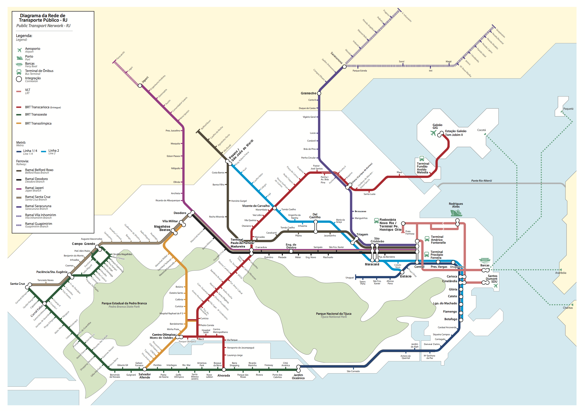

# mapa-setrans
A remix of Setrans Map

## To-Do

- Gávea is not completed ✅
- Transbrasil is not completed
- BRT Deodoro is not completed
- Vila Paciência and Cesarão 3 have been deactivated
- Morro do Outeiro is integrated to Centro Olímpico
- Teleférico do Alemão has been deactivated
- Tom Jobim 1 has been deactivated
- Tom Jobim 2 should be called Galeão / Tom Jobim 2
- Pavuna should be called Pavuna / São João de Meriti
- Gramacho transfer station
- Santa Cruz is direct from Central, without change on Deodoro
- Subway lines 1 and 4 are without transfer in General Osório
- Subway line 2 goes to Estácio on weekends
- Wrong colors
